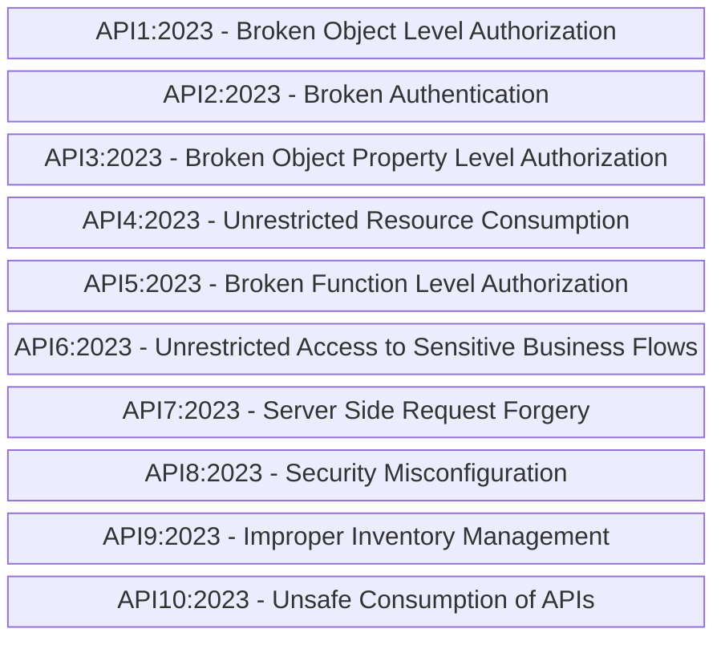
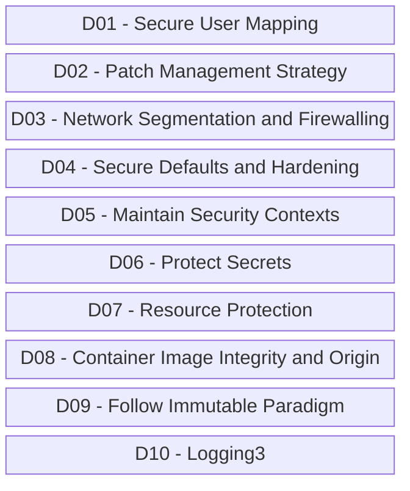
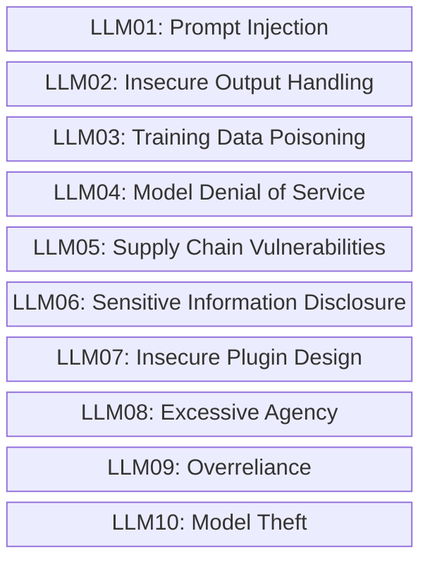

# OWASP-ApiTop10-Vulnerabilites_2025-03
Materiais de apresentação sobre OWASP API Security Top 10 realizada no dia 19/03/2025. Inclui ainda informações sobre iniciativas da OWASP para Docker/containers, Inteligência Artificial e outras tecnologias/áreas computacionais.

---

Riscos que fazem parte da **OWASP Top 10 API Security Risks - 2023**:

*OBSERVAÇÃO: Para acessar a listagem oficial clique neste [**link**](https://owasp.org/API-Security/editions/2023/en/0x11-t10/).*

---

## Outras iniciativas da OWASP

### OWASP Docker Top 10

Riscos que fazem parte da **OWASP Top 10 API Security Risks - 2023**:

*ATENÇÃO: Esta lista ainda se encontra em desenvolvimento. Maiores detalhes podem ser encontrados em: https://github.com/OWASP/Docker-Security*

### OWASP Top 10 for LLMs and Gen AI Apps

Riscos que fazem parte da **OWASP Top 10 for LLMs and Gen AI Apps**:

*ATENÇÃO: Maiores detalhes podem ser encontrados em: https://genai.owasp.org/llm-top-10-2023-24/*

## Certificações Gratuitas da APIsec University

Site da APIsec University: **https://www.apisecuniversity.com/**

Artigos que produzi sobre alguns desses treinamentos/certificações:

[**Certificação Gratuita: OWASP API Security Top 10**](https://renatogroffe.medium.com/certifica%C3%A7%C3%A3o-gratuita-owasp-api-security-top-10-49187dadd141)

[**Certificação Gratuita: API Security Fundamentals**](https://renatogroffe.medium.com/certifica%C3%A7%C3%A3o-gratuita-api-security-fundamentals-40ff8a8f2eb0)

[**Certificação Gratuita: API Gateway Security Best Practices**](https://renatogroffe.medium.com/certifica%C3%A7%C3%A3o-gratuita-api-gateway-security-best-practices-feb18932d4a5)

[**Certificação Gratuita em Inteligência Artificial: Securing LLM & NLP APIs**](https://renatogroffe.medium.com/certifica%C3%A7%C3%A3o-gratuita-em-intelig%C3%AAncia-artificial-securing-llm-nlp-apis-bd8446c38a70)

## Playlists com vídeos do YouTube sobre segurança de APIs

Clique nos links para acessar o YouTube:
- [**Segurança em aplicações .NET: MFA, JWT, frameworks, nuvem... | Canal .NET**](https://www.youtube.com/playlist?list=PLAbYWcQD84aPTzjI_Dxu5QHXq5LGJovOF)
- [**JWT + .NET: implementação de tokens, consumo, boas práticas... | Canal .NET**](https://www.youtube.com/playlist?list=PLAbYWcQD84aNfRYB8WJUAxazsKoNpMO2L)

